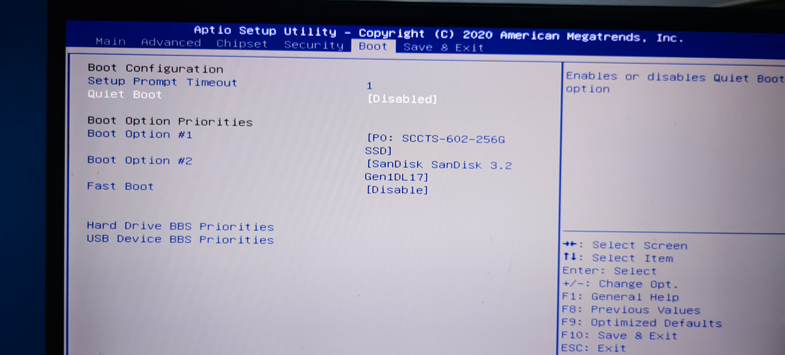
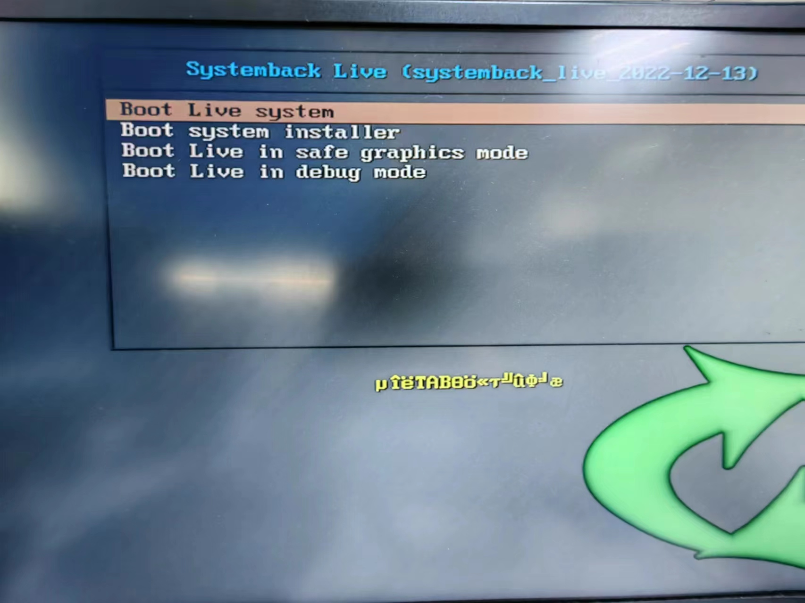
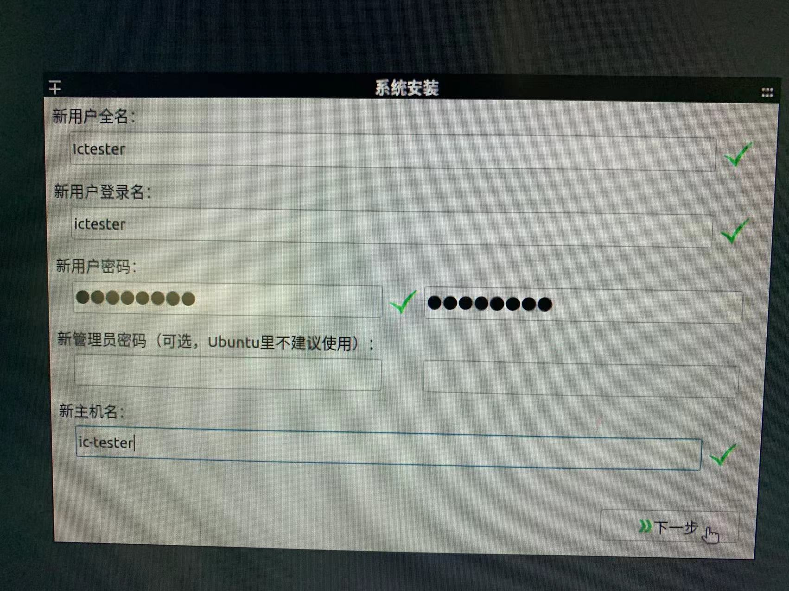
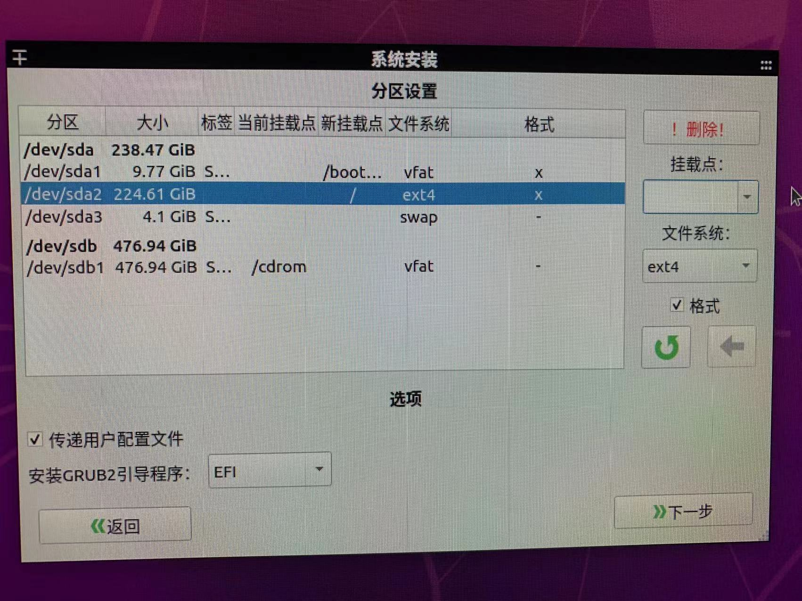
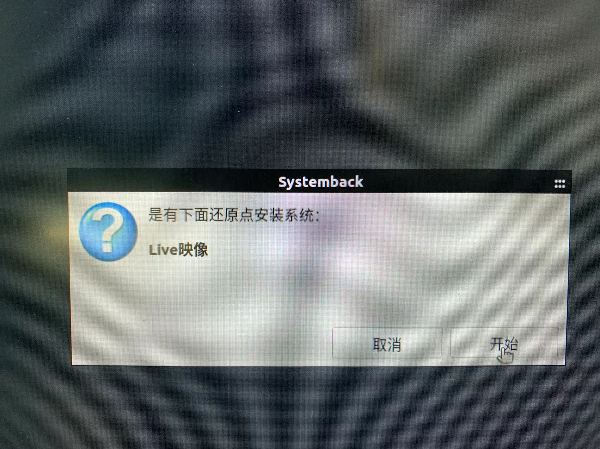
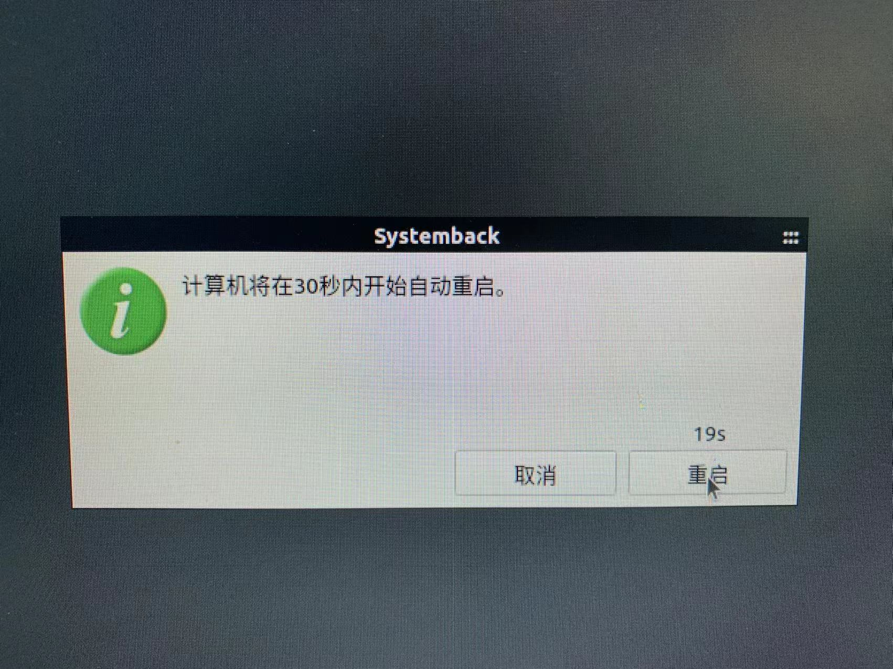
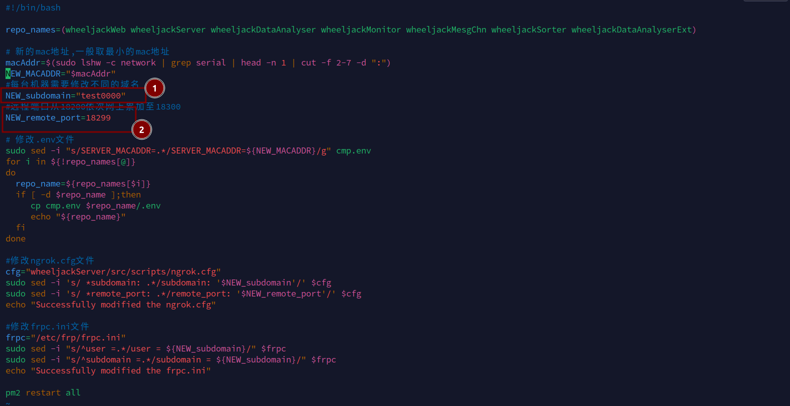

###  从零开始安装系统并部署服务
#### 1、安装系统

①重新启动，开机后按ESC进入BIOS界面，按方向键进入Boot一栏

②修改开机启动硬盘为外置硬盘（即使用U盘启动，移动光标至Boot Option Priorities的第一个选项，按下回车键，选择U盘），按F10保存并重启

③按Ctrl+C取消磁盘检查

④接上U盘（建议接usb3.0口），bios选择从U盘启动，重启后，选择第二个选项Boot system installer(有时会有乱码)，如下图

⑤输入用户名和密码，默认为

用户名：ictester

密码：abc#@123

主机名：ic-tester


⑥sda为待安装的硬盘，删除原分区，新建分区如下图

⑦点击开始

⑧点击重启，重启后拔除U盘


#### 2、部署服务

①开机后进入ubuntu系统，按Ctrl+Alt+T打开终端并修改modify.sh脚本


②修改内容如下

```
cd service/
vim modify.sh
——————————————————————
按i进入编辑模式

修改域名以及远程端口，远程端口需要依次添加（紫天使用从18200依次网上累加至18300）
NEW_subdomain="test0000"
NEW_remote_port=18299

修改完成后，按下Esc键返回命令模式，输入:wq保存退出（输入:q!强制退出不保存，输入:q不修改退出）
——————————————————————
#修改完成后执行脚本
./modify.sh

```

